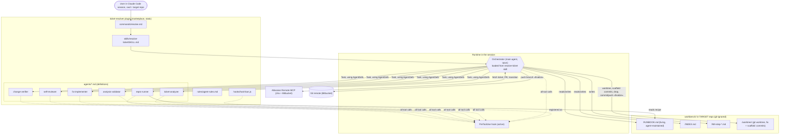
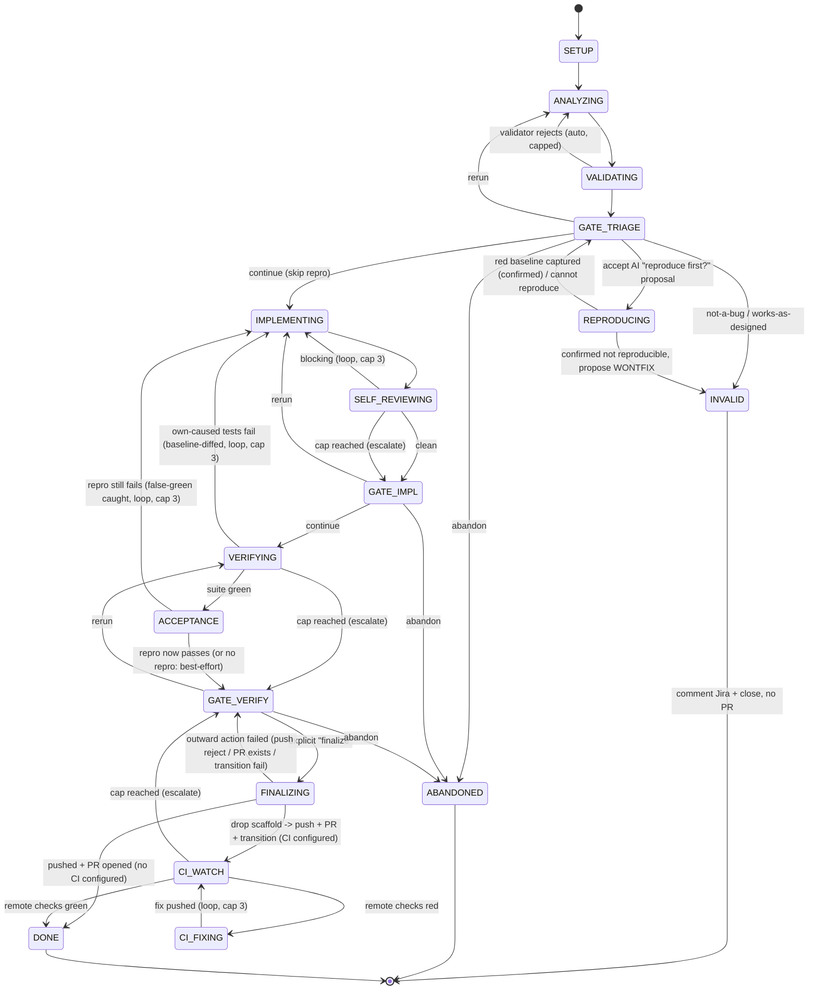
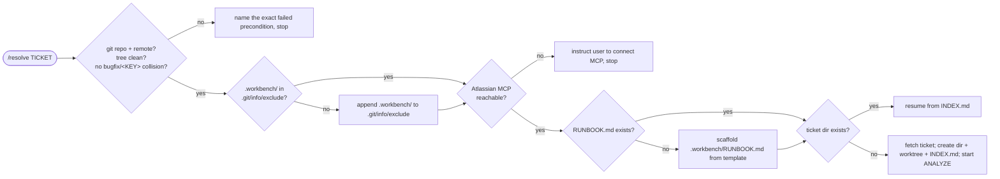

# ticket-resolver — Design Spec

**Date:** 2026-06-10
**Status:** Proposed
**Author:** alex.borysenko
**Form:** Claude Code **plugin** in the `alex-makoto-plugins` marketplace
(`C:\Users\borys\Documents\claude-plugins`), sibling to `memory-system-plugin`.

---

## 1. Purpose

`ticket-resolver` turns a single Claude Code session into a complete, human-gated bug-fixing
pipeline for a JIRA ticket. The user runs `/resolve <TICKET-KEY>` inside a target repo; an
orchestrator agent drives the ticket through five phases — **Analyze → Implement ⇄ Self-review →
Verify → Finalize** — pausing at human gates between phases, and only ever pushing code or opening
a PR on an explicit human "go".

It is a reusable, marketplace-distributed plugin: one command, one orchestrator skill, five
subagents, one safety hook. No server, no database, no UI. Everything is plain Markdown and a
single Node script — readable and editable by the user.

### Goals
- A `/resolve <TICKET-KEY>` command that drives one ticket end-to-end in any repo where the
  plugin is enabled.
- A clear phase spine with a human gate between each phase.
- Durable state in a git-ignored `.workbench/` tree in the target repo; resumable after a crash.
- Privileged outward actions (push, PR, Jira transition) reserved to the orchestrator, behind an
  explicit human confirmation.

### Non-goals (v1)
- No multi-ticket juggling per session (run multiple Claude Code sessions instead).
- No dashboard, database, or auth.
- No JIRA polling/webhooks — the user names the ticket.
- No automated outward action without human confirmation.

---

## 2. Decisions locked during brainstorming

1. **Worker mechanism:** native Claude Code subagents (`agents/*.md`), `Task`-dispatched.
2. **Jira/Bitbucket:** official Atlassian Remote MCP (OAuth via subscription — no API tokens,
   honoring the standing auth-use-subscription rule).
3. **Workspace:** single git-ignored `.workbench/` root in the target repo; each ticket gets a
   directory holding its state files **and** a dedicated git worktree.
4. **Concurrency:** one ticket per Claude Code session.
5. **INDEX.md ownership:** the orchestrator is the *sole writer*; subagents only return data.
6. **Finalize:** always requires an explicit human "finalize" command — never auto-fires.
7. **Packaging:** a plugin named `ticket-resolver` (dir `ticket-resolver-plugin/`), command
   `/resolve`, added to the `alex-makoto-plugins` marketplace.

---

## 3. Plugin vs. target repo (critical distinction)

The plugin is the **tool**; it operates **on** whatever repo the session is in.

- **Plugin repo** (`claude-plugins/ticket-resolver-plugin/`) — ships the command, skill, agents,
  hook, and bundled rules. Static, version-controlled, marketplace-distributed.
- **Target repo** (the project being fixed) — where bugs get fixed. The plugin creates
  `.workbench/` here at runtime, adds it to that repo's `.git/info/exclude`, and operates git
  worktrees here.

Nothing about a specific ticket or target repo is ever written into the plugin.

---

## 4. Use-case scenarios

Behavior contract, as interaction traces.

### UC-1 — Happy path (one-pass fix)

1. User (inside the target repo): `/resolve PROJ-1234`.
2. **Setup:** ensure `.workbench/` exists and is in the target repo's `.git/info/exclude`; fetch
   the ticket via Atlassian MCP; create `.workbench/PROJ-1234-null-pointer-on-export/` with a git
   worktree on `bugfix/PROJ-1234`; write initial `INDEX.md`.
3. **ANALYZE:** `ticket-analyzer` reads the ticket, explores the worktree, returns root cause +
   fix plan. Orchestrator writes `01-analysis-*.md`, folds findings into `INDEX.md`.
4. **VALIDATE:** `analysis-validator` (Haiku) confirms cited files/lines exist and the root cause
   is grounded. Passes. `02-validation-*.md`.
5. **GATE:** orchestrator prints a tight summary + file path, and may propose *"reproduce this
   first?"* (§13). Here the user declines and types `continue`.
6. **IMPLEMENT:** `fix-implementer` writes a failing regression test first, then edits code in the
   worktree until it passes; returns a change summary. `03-implementation-*.md`.
7. **SELF-REVIEW:** `self-reviewer` reviews the diff, nothing blocking. `04-self-review-*.md`.
8. **GATE:** user `continue`.
9. **VERIFY:** `change-verifier` runs build/tests in the worktree; green. `05-verify-*.md`.
10. **GATE → FINALIZE:** user types `finalize`. Orchestrator commits, pushes, opens a PR via MCP,
    transitions the ticket to *In Review*, writes `06-finalize-*.md`, reports the PR URL.

### UC-2 — Analysis disagreement → rerun

1. Steps 1–4 as UC-1; at the post-VALIDATE **GATE** the user replies:
   `discuss — the stack trace points at the caching layer, not the serializer`.
2. Orchestrator enters **discuss** mode: answers, no phase advance, no state mutation.
3. User: `rerun analyze, focus on the cache eviction path`.
4. Orchestrator re-dispatches `ticket-analyzer` with feedback appended, overwrites
   `01-analysis-*.md`, re-runs VALIDATE, re-prints the gate.
5. User: `continue`. Proceeds as UC-1.

### UC-3 — Self-review loop hits its cap

1. Through IMPLEMENT as UC-1.
2. SELF-REVIEW iter 1: blocking findings → loop back to IMPLEMENT with them.
3. Iters 2–3: still blocking each round.
4. Cap (3) reached → orchestrator **escalates to the user** (never silent-proceed): shows the
   unresolved findings + latest diff, asks `continue anyway` / `discuss` / `rerun with guidance` /
   `abandon`.
5. User gives guidance; orchestrator resets the counter, re-enters IMPLEMENT.

### UC-4 — Verify failure → re-implement

1. Through the post-self-review GATE; user `continue`.
2. VERIFY: tests fail; `change-verifier` returns failing names + output. `05-verify-*.md` records it.
3. Orchestrator loops back to IMPLEMENT (not to analyze), passing the failure as context.
   Implementer adjusts; SELF-REVIEW passes; VERIFY re-runs.
4. Verify cap (default 3) → on cap, escalate exactly as UC-3.
5. Green on retry → GATE → finalize as UC-1.

### UC-5 — Crash mid-run, then resume (and abandon variant)

1. Session dies during IMPLEMENT. Worktree + `.workbench/PROJ-1234-*/` survive on disk;
   `INDEX.md` records `state: IMPLEMENTING`.
2. User reopens Claude Code, runs `/resolve PROJ-1234`.
3. Orchestrator detects the existing ticket dir, reads `INDEX.md`, **resumes from the recorded
   state** — re-prints status and the last gate.
4. **Abandon variant:** at any gate the user types `abandon`. Orchestrator removes the worktree,
   deletes the local `bugfix/PROJ-1234` branch, asks whether to keep/delete the `.workbench` dir,
   and leaves the Jira ticket clean (revert transition or comment).

### UC-6 — Not a bug / can't reproduce → INVALID

1. Steps 1–4 as UC-1. ANALYZE concludes the reported behavior is working as designed (or the repro
   in REPRODUCING never fails).
2. At GATE_TRIAGE the orchestrator presents the evidence and proposes **INVALID / won't-fix**.
3. User confirms. Orchestrator transitions the ticket to the team's *Won't Fix / Needs Info* state
   via MCP, posts a comment with the evidence, writes the step file, sets `state: INVALID`. **No
   branch is pushed, no PR is opened.** Worktree is cleaned like abandon.
4. If the user disagrees (`discuss` / `rerun analyze`), it loops back exactly like UC-2.

### UC-7 — Reproduce-first battle-test (scaffold + acceptance)

1. Steps 1–4 as UC-1. At GATE_TRIAGE the orchestrator proposes *"reproduce this first?"*; user
   accepts.
2. **REPRODUCE:** `repro-runner` reads `.workbench/RUNBOOK.md`, stands up the local env per its
   recipe. The stack won't boot because the payments service is unavailable, so the runner makes a
   **temporary scaffold edit** stubbing `PaymentClient`; the orchestrator commits it as a
   `scaffold:` commit. The runner reproduces the NPE (**red baseline**) and captures a **test
   baseline** (48 pass / 0 fail). `03-reproduce-*.md`; `repro_state: confirmed`. Findings about how
   to run the stack are folded into RUNBOOK so the next ticket skips the experimentation.
3. Back to GATE_TRIAGE summary → user `continue`.
4. **IMPLEMENT / SELF-REVIEW / VERIFY** as UC-1, but VERIFY **baseline-diffs** test results so an
   unrelated pre-existing failure wouldn't loop.
5. **ACCEPTANCE:** `change-verifier` re-runs the captured repro; the NPE is gone → pass. (Had it
   still failed, it would loop back to IMPLEMENT — false-green caught.) `07-acceptance-*.md`.
6. **GATE_VERIFY → finalize:** the orchestrator **drops the `scaffold:` commit(s)**, asserts the
   push diff contains no scaffold file, then commits the fix + new test, pushes, opens the PR,
   transitions the ticket. The PaymentClient stub never reaches the PR.

### UC-8 — Finalize outward-action failure

1. Through GATE_VERIFY as UC-1/UC-7; user `finalize`.
2. Scaffold dropped, fix committed, but `git push` is **rejected** (no write permission / branch
   protection), **or** the PR already exists, **or** the Jira transition errors.
3. Orchestrator does **not** leave half-state: it reports the exact failure, keeps the commits and
   worktree intact, sets state back to **GATE_VERIFY**, and offers options (retry, fix credentials
   then retry, push manually, open PR by other means, abandon). Re-running `finalize` resumes from
   where it failed (e.g. skip push if already pushed, just open the PR).

### UC-9 — Empty RUNBOOK → bootstrap before reproduce

1. `/resolve PROJ-1234` in a repo whose `.workbench/RUNBOOK.md` is still the empty template (no local
   run/test notes yet).
2. After SETUP/ANALYZE, the orchestrator **proposes a RUNBOOK bootstrap** rather than guessing how to
   run the project. User accepts.
3. `repro-runner` investigates the run/test surface (compose, Dockerfiles, CI, Makefile, scripts,
   README) and returns evidence-backed draft notes. The orchestrator **interviews the user** for what
   the repo can't reveal — how it's really run locally, which services to stub, what's flaky/slow.
4. Orchestrator drafts `.workbench/RUNBOOK.md` from agent findings **+ user knowledge**, shows it; the
   user tweaks and confirms. Unverified entries are flagged.
5. Now armed, the orchestrator proposes **reproduce first** (UC-7) using the fresh recipe — or the
   user declines and goes straight to IMPLEMENT.
6. Every later ticket in this clone reuses the RUNBOOK; a failed recipe updates it rather than
   re-investigating from scratch.

### UC-10 — Post-PR CI gate catches a CI-only failure

1. Through FINALIZE as UC-1; the PR opens and the ticket transitions. The repo runs CI, so the
   orchestrator enters **CI_WATCH** instead of DONE.
2. It watches the PR's remote checks (GitHub Actions via `gh`, or Bitbucket Pipelines via MCP) until
   conclusive. A lint job that doesn't run locally fails — **red**.
3. **CI_FIXING:** the orchestrator fetches the failed-job logs (tailed), dispatches `fix-implementer`
   with that context, commits the fix and **re-pushes** the same branch.
4. CI re-runs → green → **DONE**, report the PR URL. (Cap 3; on cap it escalates to GATE_VERIFY with
   the CI output rather than pushing forever.)
5. If the repo has no CI, this whole gate is skipped and FINALIZE goes straight to DONE.

---

## 5. Architecture

### 5.1 Component diagram (plugin → session → target repo)



### 5.2 Responsibility split

```mermaid
classDiagram
    class Orchestrator {
        +runStateMachine()
        +renderGate()
        +proposeReproduce()  «AI proposal at gate»
        +rewriteIndex()  «sole writer»
        +maintainRunbook()  «.workbench/RUNBOOK.md, sole writer»
        +gitWorktreeLifecycle()
        +scaffoldCommit()  «label 'scaffold:', privileged»
        +dropScaffoldCommits()  «before finalize»
        +commitPushPR()  «privileged, finalize only»
        +jiraTransition() «privileged»
        +mcpFetchTicket()
    }
    class ticket_analyzer { +readTicket()  +exploreRepo()  +rootCause()  +fixPlan()  ; readOnly:code ; opus }
    class analysis_validator { +checkCitationsExist()  +groundedness()  ; readOnly:code ; haiku }
    class repro_runner { +standUpEnv() per RUNBOOK  +reproduceBug()  +captureBaseline()  +scaffoldEdit() ; read+run+scaffold-edit ; sonnet }
    class fix_implementer { +writeFailingTest() «TDD»  +applyFix() in worktree ; canEdit:code ; forbid:push/commit/reset ; sonnet }
    class self_reviewer { +reviewDiff()  +blockingFindings()  ; readOnly:code ; opus }
    class change_verifier { +baselineDiff()  +runBuild()  +runTests()  +acceptanceRepro() ; read+run ; devServer:RUNBOOK-allowlisted ; sonnet }

    Orchestrator --> ticket_analyzer : Task
    Orchestrator --> analysis_validator : Task
    Orchestrator --> repro_runner : Task «if reproduce approved»
    Orchestrator --> fix_implementer : Task
    Orchestrator --> self_reviewer : Task
    Orchestrator --> change_verifier : Task
```



Invariant: **only the orchestrator performs outward/irreversible actions** (push, PR, Jira
transition, worktree create/destroy, **all git commits including `scaffold:` commits**). Subagents
reason; `fix-implementer` and `repro-runner` write files, only inside the worktree. **Temporary
scaffold edits** (disabling heavy parts, stubbing services for local repro/verify) are quarantined
in `scaffold:`-labeled commits and **dropped before finalize** — they never reach the PR (§13).

### 5.3 State machine



New states vs the original spine:
- **REPRODUCING** — entered only when the user accepts the orchestrator's *"shall I reproduce this
  first?"* proposal (AI proposal, human-approved). Stands up the env per the RUNBOOK, confirms the
  bug fails, captures a **red baseline** + a **test baseline** (§13).
- **ACCEPTANCE** — after the suite is green, re-runs the captured repro; the bug must now pass.
  Closes the false-green gap: green tests alone never finalize a ticket that had a repro.
- **INVALID** — terminal for not-a-bug / works-as-designed / confirmed-not-reproducible. Comments
  Jira, closes cleanly, opens **no** PR.
- **CI_WATCH / CI_FIXING** — optional post-PR gate (§14.4). After the PR is opened, if the repo runs
  CI, watch the remote checks; on red, a fix loop addresses the failure and re-pushes (cap 3) before
  the ticket reaches DONE. Skipped entirely when no CI is configured. Local VERIFY can miss
  CI-only failures (different OS, stricter lints, integration suites) — this closes that gap.

Every gate also supports **discuss** (self-loop, no state change), omitted for clarity. The
**baseline diff** at VERIFYING means pre-existing/flaky failures present *before* the fix don't
trigger the re-implement loop — only failures the change introduces do.

### 5.4 Happy-path sequence

```mermaid
sequenceDiagram
    actor U as User
    participant O as Orchestrator
    participant M as Atlassian MCP
    participant FS as .workbench/<TICKET>
    participant AN as ticket-analyzer
    participant VA as analysis-validator
    participant IM as fix-implementer
    participant SR as self-reviewer
    participant VE as change-verifier
    participant G as Git remote

    U->>O: /resolve PROJ-1234
    O->>M: get ticket PROJ-1234
    M-->>O: summary, description, comments
    O->>FS: mkdir, git worktree add, write INDEX.md
    O->>AN: Task(analyze)
    AN-->>O: root cause + fix plan
    O->>FS: 01-analysis.md ; rewrite INDEX.md
    O->>VA: Task(validate)
    VA-->>O: grounded ✓
    O->>FS: 02-validation.md
    O-->>U: GATE: summary + path
    U-->>O: continue
    O->>IM: Task(implement)
    IM->>FS: edit code in worktree
    IM-->>O: change summary
    O->>FS: 03-implementation.md ; rewrite INDEX.md
    O->>SR: Task(review diff)
    SR-->>O: no blocking findings
    O->>FS: 04-self-review.md
    O-->>U: GATE
    U-->>O: continue
    O->>VE: Task(build + test)
    VE-->>O: green
    O->>FS: 05-verify.md
    O-->>U: GATE
    U-->>O: finalize
    O->>G: commit + push bugfix/PROJ-1234
    O->>M: create PR + transition ticket
    M-->>O: PR URL
    O->>FS: 06-finalize.md ; rewrite INDEX.md (DONE)
    O-->>U: PR URL + done
```

---

## 6. Plugin file layout

```
claude-plugins/                                  (marketplace repo)
  .claude-plugin/marketplace.json                ← add ticket-resolver entry
  ticket-resolver-plugin/
    .claude-plugin/plugin.json                   name "ticket-resolver", v0.1.0
    commands/
      resolve.md                                 /resolve <KEY> (run/resume) | /resolve (list open tickets)
      resolve-wrap-up.md                          /resolve-wrap-up — clean pause + handoff of the active ticket (§12)
      resolve-runbook.md                          /resolve-runbook — investigate + interview → draft/refresh RUNBOOK (§13.2)
    skills/
      resolve-ticket/SKILL.md                    orchestrator core (step machine + gates)
    agents/
      ticket-analyzer.md                          opus, read-only
      analysis-validator.md                       haiku, read-only
      repro-runner.md                             sonnet, read+run+scaffold-edit (REPRODUCE, §13)
      fix-implementer.md                          sonnet, edit-in-worktree (TDD test-first)
      self-reviewer.md                            opus, read-only
      change-verifier.md                          sonnet, read+run (baseline-diff + acceptance)
    hooks/
      hooks.json                                  SessionStart → check-recommended-plugins.js ; PreToolUse → hard-ban.js
      check-recommended-plugins.js                Node soft-check: warns on missing recommended plugins (§11)
      hard-ban.js                                 Node enforcement script (TR_ORCH / TR_FINALIZE / TR_RUN_ALLOW markers, §8)
    bin/
      setup-workbench.js                          (optional) ensure .workbench + .git/info/exclude + RUNBOOK
      workbench-index.js                          derive ticket list from .workbench/*/INDEX.md frontmatter (§12)
    templates/
      runbook.md                                  scaffold copied to .workbench/RUNBOOK.md on first run (§13)
    rules/
      agent-rules.md                              hard-rule text (injected into agent prompts)
    recommended-plugins.json                      editable list of recommended companion plugins (§11)
    models.json                                   role → model override map (§14.2); orchestrator reads at dispatch
    docs/
      design.md                                   this spec
    README.md
```

Marketplace entry:

```json
{ "name": "ticket-resolver", "source": "./ticket-resolver-plugin",
  "version": "0.1.0",
  "description": "JIRA-driven bug-fix orchestrator: analyze → implement → review → verify → PR, human-gated." }
```

All in-plugin paths use `${CLAUDE_PLUGIN_ROOT}`.

---

## 7. Target-repo state files (runtime, git-ignored)

### 7.1 Layout (created in the target repo)

```
<target-repo>/
  .git/info/exclude                ← ".workbench/" appended (per-clone, uncommitted)
  .workbench/
    RUNBOOK.md                     living local-run/test runbook, agent-maintained (§13)
    protocols/                     optional named custom protocols (§13.6)
    PROJ-1234-null-pointer-on-export/
      INDEX.md
      01-analysis-null-pointer-on-export.md
      02-validation-null-pointer-on-export.md
      03-reproduce-null-pointer-on-export.md       (only if the reproduce proposal was accepted)
      04-implementation-null-pointer-on-export.md
      05-self-review-null-pointer-on-export.md
      06-verify-null-pointer-on-export.md
      07-acceptance-null-pointer-on-export.md       (repro re-run; only if reproduced)
      08-finalize-null-pointer-on-export.md
      worktree/                    git worktree, branch bugfix/PROJ-1234
                                   (fix commits + scaffold: commits, the latter dropped at finalize)
```

- **Ticket dir:** `<TICKET-KEY>-<kebab-one-line-description>`.
- **Step file:** `<NN>-<step-type>-<kebab-one-line-description>.md`, `NN` zero-padded, monotonic.
  Rerunning a phase overwrites its step file (state, not history). REPRODUCE/ACCEPTANCE step files
  exist only when the reproduce proposal was accepted.
- **RUNBOOK.md** sits at the `.workbench/` root (not per-ticket): one living runbook per clone,
  shared by every ticket, owned by the orchestrator (§13).

### 7.2 INDEX.md — the living state

Single source of truth, **rewritten in full by the orchestrator after every phase**. Current
state, not a log. The **YAML frontmatter carries the machine-readable index fields** that
`bin/workbench-index.js` reads to list/resume tickets (mirroring memory-system's frontmatter-as-index
discipline, §12); the **body carries the agent-readable findings, decisions, and the immediate next
action**.

```markdown
---
ticket: PROJ-1234
slug: PROJ-1234-null-pointer-on-export
title: Null pointer on export
state: IMPLEMENTING
branch: bugfix/PROJ-1234
base_sha: 9f3c1a2
worktree: .workbench/PROJ-1234-null-pointer-on-export/worktree
self_review_iter: 1
verify_iter: 0
repro_state: confirmed
baseline_captured: true
scaffold_commits: 1
debt_count: 0
sub_steps_total: 0
sub_steps_done: 0
summary: NPE on export — null-check at the serializer boundary
topics: [export, serializer, npe]
next_action: Re-run fix-implementer addressing the self-review null-order finding
updated: 2026-06-10T14:22Z
---

# PROJ-1234 — Null pointer on export

## Task
<one-paragraph problem statement from the ticket>

## Acceptance criteria (what "fixed" means — checked at ACCEPTANCE)
- [ ] Empty-result export returns 200 with an empty file, no NPE.
- [ ] Existing export behavior for non-empty results unchanged.
<!-- Derived from the ticket by the analyzer; each is a concrete, checkable statement. -->

## Core findings (relevant & current only)
- Root cause: ExportService serializes before null-check on `rows`.
- Repro: export with an empty result set.

## Decisions (latest & relevant only)
- Fix at the serializer boundary, not the caller.

## Architecture nuances (relevant only)
- ExportService shared by 3 controllers; change must stay backward-compatible.

## Reproduce & baseline (if reproduced)
- Repro recipe (from RUNBOOK): export an empty result set via `POST /export` against local stack.
- Red baseline: repro throws NPE at ExportService:142 (captured pre-fix).
- Test baseline: `export` module 48 pass / 0 fail before any change (flaky-diff reference).

## Scaffold (temporary — dropped before finalize)
- `scaffold:` commit stubs `PaymentClient` so the local stack boots without the payments service.
- Must be dropped before push; finalize asserts no `scaffold:` commit remains.

## Debt (accepted gaps — documented in the PR body)
<!-- Typed, severity-rated items when a criterion is consciously deferred (accept-with-debt). Empty
     when the fix is complete. Each downstream/reviewer reads these as data, not prose. -->
- _(none)_
<!-- shape: { criterion, severity: low|med|high, justification, follow_up_ticket? } -->


## Sub-steps (only if the fix was split)
<!-- Ordered. The fix was too big for one diff, so it's done as sequential sub-steps in this same
     worktree/branch — each its own implement→review→verify cycle. -->
1. [x] Add null-check at the serializer boundary.
2. [ ] Add input validation for empty result sets.
3. [ ] Update the stale export regression test.

## Tried & rejected (durable loop memory)
<!-- Survives resume. The implement loop reads this so it never repeats a dead end. -->
- Fix in the controller — rejected: breaks 2 other endpoints that share ExportService.
- Guard in the caller — rejected: leaves 3 other callers still vulnerable.

## Next action
- The single immediate step to take on resume (mirrors `next_action:` in frontmatter).

## Task memory
- Verify runs inside worktree; build: `mvn -q verify -pl export`.
```

**Pruning rule:** on each rewrite, drop findings/decisions no longer true or relevant. Detail
lives in the numbered step files; INDEX stays small enough to re-read cheaply on resume.

---

## 8. Tool-gating & hard rules

Two layers keep subagents inside their lane:

1. **Per-agent allowlists** (`tools:` frontmatter in each `agents/*.md`). `fix-implementer` gets
   `Read, Write, Edit, Grep, Glob, Bash`; analyzer/validator/reviewer get no `Write`/`Edit`; only
   the orchestrator holds the MCP Jira/Bitbucket tools.

2. **`PreToolUse` hook** (`hooks/hard-ban.js`, Node — cross-shell, Windows-safe) for bans an
   allowlist can't express. Denies by default:
   - `git push`, `git commit`, `git reset --hard`, `git rebase`, `git checkout -- .`, `--no-verify`
   - long-running / dev-server starts (`mvn spring-boot:run`, `npm run start`, `ng serve`, …)
   - destructive deletes (`rm -rf`, `del -rf`) and process kills

   **Two scoped exceptions, both keyed off env markers the orchestrator sets (subagent `Task`
   frames never inherit them):**

   - **`TR_ORCH=1` — orchestrator-only git writes.** All `git commit` (including `scaffold:`
     commits) and worktree/branch lifecycle are allowed only with this marker; subagents are never
     allowed to commit. `git push` additionally requires **`TR_FINALIZE=1`** (set only during
     FINALIZING). This generalizes the original finalize-only exception and is the mechanism that
     resolves the old open question — default (a), an env marker.
   - **`TR_RUN_ALLOW` — RUNBOOK-gated run commands.** During REPRODUCING and VERIFYING the env may
     genuinely need to start services (a dev server, `docker compose up`, a DB). The orchestrator
     exports `TR_RUN_ALLOW` carrying the **explicit command allowlist from the RUNBOOK** (§13.4);
     the hook permits a start command only if it matches an allowlisted pattern, and the protocol
     requires each such start to be backgrounded with a recorded **teardown** step + timeout. Outside
     REPRODUCING/VERIFYING, or for any command not on the RUNBOOK allowlist, the dev-server ban
     stands. This keeps "no runaway dev servers" while still allowing real local battle-testing.

The same rule text lives at `rules/agent-rules.md` and is injected into agent prompts as a
belt-and-braces measure.

---

## 9. Setup flow (first `/resolve` in a target repo)



**Git preconditions (C0)** are checked before anything is created, so setup never leaves
half-state: the cwd must be a git repo with a push remote, the working tree should be clean (or the
orchestrator warns and asks), and no local `bugfix/<KEY>` branch may already collide. A missing
remote / non-git repo stops with a clear instruction, exactly like MCP-down.

`.git/info/exclude` (not `.gitignore`) keeps the ignore **per-clone and uncommitted** — the
requested "automatically excluded in the .git directory" behavior. Done by `bin/setup-workbench.js`
or inline by the orchestrator. On first run it also scaffolds an empty `.workbench/RUNBOOK.md` from
the plugin template (§13); the runbook then accretes across tickets. When the RUNBOOK is still empty,
the orchestrator **proposes a bootstrap** (investigate the run/test surface + interview the user)
before the first reproduce — it never guesses how to run the project (§13.2, UC-9).

---

## 10. Error handling & resilience

- **Crash/resume:** state in `INDEX.md`; `/resolve <TICKET>` re-reads and resumes (UC-5).
- **Subagent returns garbage/empty:** treated as a failed phase, surfaced at a gate, not guessed.
- **Loop caps:** self-review 3, verify 3, acceptance 3 (configurable in the skill). On cap →
  escalate, never silent-proceed (UC-3, UC-4).
- **Not a bug / works-as-designed / can't reproduce:** → **INVALID** terminal (UC-6); comment Jira,
  close, no PR. Never silently invent a fix for a non-bug.
- **False green:** suite green but the captured repro still fails → ACCEPTANCE loops back to
  IMPLEMENT (UC-7), not finalize.
- **Pre-existing / flaky failures:** baseline test run captured at REPRODUCE (or first VERIFY) is
  diffed against post-change results; only **own-caused** failures drive the re-implement loop.
- **Finalize failure:** push rejected / PR already exists / Jira transition fails → return to
  GATE_VERIFY with the exact error; the worktree and commits are intact, nothing half-pushed (UC-8).
- **CI red after PR (optional gate):** CI_FIXING loop addresses failed remote checks and re-pushes
  (cap 3); on cap, escalate with the CI logs rather than looping (UC-10). No CI → gate skipped.
- **Fatal subagent envelope:** a subagent returning `fatal` (corrupt worktree, missing toolchain)
  halts to a human gate instead of looping the phase.
- **Scaffold leak guard:** finalize asserts no `scaffold:` commit and no scaffold file remains in the
  push diff before it pushes; if any remain, it stops and reports rather than shipping a test hack.
- **Env won't start (REPRODUCE):** soft-skip with `repro_state: not-reproduced` recorded + a gate
  caveat; the user may proceed without a red baseline (acceptance becomes best-effort) or abandon.
- **MCP unreachable:** setup stops with a clear instruction; no half-created state.
- **Git precondition fails (no repo/remote, branch collision, dirty tree):** setup stops naming the
  exact precondition; nothing created.
- **Abandon:** removes worktree + local branch, asks about `.workbench` dir, leaves ticket clean.

---

## 11. Recommended companion plugins (soft requirement)

`ticket-resolver` runs better alongside three other tools, but none is hard-required.

| Plugin | Form | Why it helps |
|--------|------|--------------|
| **caveman** | plugin | Compresses orchestrator/subagent output ~75% — keeps the long, multi-phase `/resolve` run inside the context window. |
| **graphify** | skill + CLI | Knowledge graph of the target repo so `ticket-analyzer` queries architecture/relationships instead of blind grep — faster, better-grounded root-cause. |
| **superpowers** | plugin | Brainstorming / TDD / systematic-debugging / verification skills the implement & verify phases lean on. |

### 11.1 Why a *soft* requirement

Claude Code has **no native plugin-dependency field**. `plugin.json` and `marketplace.json`
carry only metadata (`name`, `version`, `description`, `author`, …) — there is no `dependencies`,
`requires`, or auto-install mechanism, and no built-in pre-flight that blocks a plugin when a
companion is absent. So the requirement is expressed as a **non-blocking advisory**, never a gate:
`/resolve` always runs; missing companions only degrade convenience, not correctness.

### 11.2 Mechanism

1. **Editable list — `recommended-plugins.json`** (plugin root). One entry per companion:
   `id`, `label`, `required` (`false` = recommended), `why`, a `detect` spec, and an `install`
   hint. This file is the single place to add, remove, or retune recommendations — no code change.

2. **SessionStart soft-check — `hooks/check-recommended-plugins.js`** (Node, cross-platform).
   On session start it reads the list, detects each entry, and **warns only about what's missing**;
   when everything is present it prints nothing (no nag). It always exits 0 — it can never block a
   session. The warning tells the orchestrator to mention the gap to the user **once** per session.

### 11.3 Detection per type

The companions don't share one enable surface, so `detect.type` selects the probe:

- `"plugin"` (caveman, superpowers): a key `"<name>@<marketplace>"` set `true` in the
  `enabledPlugins` map of `~/.claude/settings.json` (project `.claude/settings*.json` merged on top).
- `"tool"` (graphify — a personal **skill + CLI**, *not* a marketplace plugin): a skill dir
  `~/.claude/skills/<skill>/SKILL.md`, **or** the `<command>` resolvable on `PATH`.

A miss in either probe only warns, so an unusual install layout costs a spurious nudge, never a block.

### 11.4 Making the list mutable later

Editing `recommended-plugins.json` is the whole API: add an object to `recommended[]` to introduce
a new companion, flip `required` to `true` to escalate the wording (still non-blocking), or delete an
entry to drop it. The hook re-reads the file every session, so changes take effect with no rebuild.
The README's "Recommended setup" section restates the list for humans who never trigger the hook.

---

## 12. Session continuity — wrap-up & resume

This is the memory-system pattern applied to tickets: durable per-ticket state, a script-derived
index, an explicit wrap-up for a clean handoff, and resume that loads exactly one ticket. Nothing
new is invented — `ticket-resolver` already keeps state in `INDEX.md` and resumes (§7, UC-5); §12
makes that a first-class, discoverable workflow that matches `memory-system`.

### 12.1 The parallel to memory-system

| memory-system | ticket-resolver |
|---------------|-----------------|
| `tasks/<slug>.md` journal | `.workbench/<TICKET>/INDEX.md` |
| `mem-index.js tasks` (frontmatter → index) | `bin/workbench-index.js` (frontmatter → index) |
| `/mem-wrap-up` | `/resolve-wrap-up` |
| "Next Steps, first bullet = immediate next action" | `next_action:` + `## Next action` |
| resume = match by slug/title, load one journal, surface Next Steps | resume = match by ticket key, load one INDEX.md, surface `next_action` |

Both follow the same discipline: **no on-disk master index** (the script derives it on demand), and
**current state, not a log** (each file is rewritten to truth, history lives in git).

### 12.2 INDEX.md frontmatter is the discovery primitive

INDEX.md carries YAML frontmatter (§7.2): `ticket, slug, title, state, branch, worktree, summary,
topics, next_action, updated`. `workbench-index.js` reads **only** the frontmatter — it never opens
a worktree — so listing all tickets is cheap. The body remains the living findings/decisions/next
store.

### 12.3 `bin/workbench-index.js` — the ticket index

```
node ${CLAUDE_PLUGIN_ROOT}/bin/workbench-index.js [--base .workbench] [--json]
```

Scans each `.workbench/<dir>/INDEX.md`, parses frontmatter, buckets by `state` (`DONE` → done,
`ABANDONED` → abandoned, everything else → open), sorts open most-recently-updated first, and prints
a markdown list (ticket key, title, state, `next_action`, `updated`, link). Deterministic and always
current. Dirs without a frontmatter'd INDEX.md (e.g. a bare `worktree/`) are skipped.

### 12.4 `/resolve-wrap-up` — clean pause + handoff

Distinct from **finalize** (which pushes, opens the PR, transitions Jira — §4, §8). Wrap-up never
touches git or the remote; it makes the active ticket safe to leave:

1. Rewrite `INDEX.md` in full to current truth: set `state:`, prune stale Core findings / reversed
   Decisions, set `next_action:` to the single immediate next step, bump `updated:`.
2. Leave the worktree + `bugfix/<KEY>` branch intact; if there is uncommitted WIP, describe it in
   the body so the next session knows where things stand. Do **not** commit on wrap-up.
3. Report 2-3 lines: ticket, state, `next_action`, INDEX.md path, and the resume hint.

Because state is already durable after every phase, wrap-up is cheap insurance — it just guarantees
`next_action` and `updated` are crisp for the next session.

### 12.5 Resume by ticket ID (new session)

- `/resolve` **with no key** → run `workbench-index.js`, show open tickets (key, state,
  `next_action`), ask which to resume. Index-first discovery, mirroring memory-system startup.
- `/resolve <KEY>` where `.workbench/<KEY>-*/` **exists** → read that `INDEX.md`, resume from `state`
  at the recorded gate, surface `next_action`. This is UC-5, now index-assisted.
- `/resolve <KEY>` where **no dir exists** → fresh run from `SETUP`.

Matching is by ticket-key prefix on the directory name; the one-ticket-per-session rule (§2) keeps
this unambiguous.

### 12.6 Optional SessionStart hint

A SessionStart hook may run `workbench-index.js` and, if open tickets exist, print one line —
`N open ticket(s) in .workbench/ — /resolve <KEY> to resume` — the ticket-resolver analog of
memory-system's startup index load. Reuse the §11 soft-check hook style (advisory, never blocking);
keep it off by default in repos that don't use the plugin.

---

## 13. Local battle-testing protocol, the RUNBOOK & custom-instruction injection

This answers the question *"how does a fixed five-phase pipeline absorb project-specific reality —
standing up a real local environment, reproducing the bug first, temporarily disabling heavy parts
for testing — without hardcoding any of it into the plugin?"* The answer is **data, not code**: a
living per-repo runbook that the agents read and write, plus two narrow, profile-gated capability
exceptions. The plugin ships zero project knowledge; everything project-specific accretes in the
target repo's `.workbench/RUNBOOK.md`.

### 13.1 The problem

The hardcoded spine (analyze → implement → review → verify) is repo-agnostic on purpose. But real
bug work needs repo-specific moves the plugin can't know in advance: which command boots the stack,
which services can be stubbed, how to reproduce *this* class of bug, what's flaky, what's too slow to
run and should be disabled for a local test. Re-deriving that every ticket is waste. So the system
needs (a) a place to **remember** it and (b) controlled **hooks in the flow** to act on it.

### 13.2 `RUNBOOK.md` — the living, agent-maintained runbook

One file per clone at `.workbench/RUNBOOK.md` (git-ignored, like the rest of `.workbench/`), shared
by every ticket. It is to *local run/test know-how* what memory-system's `architecture_cache.md` is
to *architecture*: **the orchestrator is its sole writer**; agents return proposed additions and the
orchestrator folds them in (same ownership rule as INDEX.md). It starts as an empty template
(scaffolded at setup) and **accretes findings** so each ticket goes straight to the known-good
pipeline instead of experimenting.

Sections (template in `templates/runbook.md`):

````markdown
---
updated: YYYY-MM-DD
---
# Local run & test runbook

## How to run locally
- Stack up: `docker compose up -d db redis` then `mvn -q spring-boot:run -pl app`
- Required env / ports / seed data; auth shortcuts for local.

## Reproduce recipes (by area)
- <area>: <exact steps / request / fixture that triggers the class of bug>

## Run & verify command allowlist   ← source of TR_RUN_ALLOW (§13.4)
- allow: `docker compose up *`, `mvn -q verify*`, `npm test*`
- each long-running start MUST be backgrounded + has a teardown line below.
- teardown: `docker compose down`

## Scaffold allowlist (temporary edits OK for local testing)   ← §13.5
- OK: stub `PaymentClient`, point `DATA_SOURCE` at the local DB, disable the nightly-batch bean.
- NOT OK: anything that changes the behavior under test.

## System state & gotchas
- `payments` service rarely available locally → stub it.
- `export` integration tests need the `seed-export.sql` fixture; ~90s.
````

#### Bootstrapping an empty RUNBOOK (first-run investigation + user interview)

When `/resolve` finds **no RUNBOOK, or only the empty template** (no local run/test notes yet), the
orchestrator does not guess and does not silently skip. It **proposes a bootstrap**:

> "This repo has no local run/test notes yet. Want me to (a) investigate how to build, run, and test
>  it locally, and (b) capture what *you* already know — so I draft an initial RUNBOOK we both trust?"

On accept, two inputs are merged into the first draft:

1. **Investigation (agent).** `repro-runner` runs read-only discovery over the run/test surface —
   `docker-compose*.yml`, Dockerfiles, CI configs, `Makefile`, `package.json` scripts,
   `pom.xml`/Gradle, run scripts, `README`/`CONTRIBUTING`/`docs/` — and may do a light, allowlisted
   build/test probe to see what actually works. It returns proposed "How to run", "Run & verify
   command", "Scaffold allowlist", and "Gotchas" entries, each with **file:line evidence**.
2. **User interview.** The orchestrator asks a few targeted questions for what the repo can't reveal:
   how the env is really run day-to-day, which services are usually unavailable locally and safe to
   stub, known-flaky or slow areas, auth/seed shortcuts. Answers are captured **verbatim** into the
   matching sections, tagged user-supplied vs agent-inferred.

The orchestrator (sole writer) drafts `.workbench/RUNBOOK.md` from both, shows it, and the user
edits/confirms. Unverified entries are marked so a later REPRODUCE confirms or repairs them — the
runbook improves every ticket. Re-runnable anytime with **`/resolve-runbook`** (also the way to
refresh a stale runbook). If the user declines, the empty template stays and REPRODUCE is simply
unavailable until notes exist (re-offer once per ticket, never nag). This is the ticket-resolver
analog of memory-system's architecture-cache initialization (UC-9).

### 13.3 REPRODUCE is an AI proposal, not a forced phase

If the RUNBOOK is still empty when this point is reached, the orchestrator proposes the **bootstrap
above** first — there is nothing to reproduce *from* without a recipe.

At GATE_TRIAGE the orchestrator proposes — *"I can reproduce this first (stand up the env per the
RUNBOOK, confirm the bug fails) before implementing. Do that?"* The human decides:

- **Accept** → enter REPRODUCING: `repro-runner` follows the RUNBOOK recipe, captures a **red
  baseline** (the failing repro) and a **test baseline** (suite pass/fail counts, for the flaky
  diff), folds any new run know-how back into RUNBOOK. A reproduced bug arms **ACCEPTANCE** at the
  end — the same repro must go green before finalize, killing false-greens.
- **Decline** → straight to IMPLEMENT (UC-1); acceptance falls back to best-effort.
- **Can't reproduce** after a real attempt → propose **INVALID/WONTFIX** (UC-6), don't fake a fix.

### 13.4 Run-command allowlist — battle-testing without runaway servers

§8 bans dev-server / long-running starts by default to stop subagents hanging the session. Real
battle-testing needs exactly those. Reconciled by a **profile-gated exception**: during REPRODUCING
and VERIFYING the orchestrator exports `TR_RUN_ALLOW` carrying the RUNBOOK's explicit command
allowlist; the hook permits a start **only** if it matches an allowlisted pattern, **and** the
protocol requires every long-running start to be backgrounded with a recorded teardown + timeout.
Nothing on the allowlist → still banned. So "no runaway servers" holds while genuine local infra is
allowed, and the allowlist is per-repo data in the RUNBOOK, not plugin code.

### 13.5 Temporary scaffold edits — quarantine & mandatory drop

To make a stack testable locally, the agent may need to edit code that is **not the fix** (stub a
service, disable a heavy bean, swap a datasource). These are dangerous only if they leak into the PR.
Containment:

1. Scaffold edits are allowed only for patterns in the RUNBOOK **scaffold allowlist** (§13.2).
2. The orchestrator commits them as **separate `scaffold:`-prefixed commits**, never mixed into fix
   commits.
3. INDEX tracks `scaffold_commits:`; the body's **Scaffold** section says what each does and how it
   is undone.
4. **Finalize drops every `scaffold:` commit** (rebase/reset them away) and then **asserts** the
   push diff contains no scaffold commit and no scaffold-touched file before it pushes. If anything
   remains, finalize stops and reports — a test hack can never reach the PR (UC-7, §10 scaffold-leak
   guard).

This is why the chosen mechanism is "labeled commit dropped pre-finalize": it makes the fix diff and
the throwaway scaffolding physically separate in git, so the guarantee is a cheap `git log` assertion
rather than trusting a hand-maintained file list.

### 13.6 Custom-instruction injection & named protocols (the general mechanism)

The user's broader ask — *"inject custom instructions outside the pipeline, or custom pipelines"* —
is served at three levels, cheapest first:

1. **RUNBOOK injection (default).** RUNBOOK sections are injected into the relevant Task prompts:
   "How to run" + "Run allowlist" → repro-runner / change-verifier; "Scaffold allowlist" →
   repro-runner / fix-implementer; "Gotchas" → analyzer. This is custom per-project behavior with
   **no plugin change** — edit the RUNBOOK, change the behavior.
2. **Per-ticket extra instructions.** A ticket may carry a `protocol:` note or free-text guidance in
   its INDEX; the orchestrator injects it into that ticket's phases only.
3. **Named protocols (extension point).** `.workbench/protocols/<name>.md` holds an alternate or
   additional sequence (e.g. a `flaky` protocol that runs the suite N times to catch intermittency,
   or a `perf` protocol that captures a benchmark baseline). Selected per run —
   `/resolve <KEY> --protocol flaky` or chosen at a gate — the protocol's markdown steps are
   executed by the orchestrator the same way a built-in phase is. v1 ships the built-in spine + the
   REPRODUCE protocol; named protocols are the documented seam for adding more without forking the
   plugin.

### 13.7 What "execute the protocol in the orchestrator flow" actually means

The orchestrator is a skill — Markdown instructions, not code. "Executing a protocol" = the
orchestrator **reads** the RUNBOOK / protocol file and **follows** its steps, **injecting** the
relevant slices into the subagent Task prompts and honoring the allowlists via the env markers
(§8/§13.4). It is instruction-injection end to end: no new engine, no DSL. The only state changes are
the same ones every phase makes — write a step file, rewrite INDEX, and (the new part) fold durable
run/test findings back into RUNBOOK so the next ticket is faster. The hard rules (orchestrator-only
git, scaffold quarantine, human gates) bound every protocol, custom or built-in, so extensibility
never widens the blast radius.

---

## 14. Lessons from large-scale agent orchestration (SWE-AF) — adopted & rejected

AgentField's *Beyond Vibe Coding* describes orchestrating 200+ harnesses to ship epics. That system
is a **parallel multi-issue builder**; `ticket-resolver` is a **single-ticket, human-gated fixer**.
Different scale, but several of their primitives sharpen ours. We adopt what fits a careful one-bug
flow and explicitly reject what only pays off at fan-out scale.

### 14.1 Adopted

1. **Two LLM "modes," not one** (their `.ai()` constrained call vs `.harness()` agentic loop). Most
   of our work is agentic harness, but routing/triage decisions should be **cheap constrained
   classifications**, not full agents: "is this actually a bug?", "is this change high-risk /
   security-sensitive?", "does the diff need a deeper review pass?". `analysis-validator` (haiku,
   no tools) is already this shape; we extend the pattern — the orchestrator may make small
   haiku-class judgments to gate expensive phases instead of always spending a full agent.

2. **Acceptance-criteria-driven verification.** They verify *every acceptance criterion from the
   original requirements* against the codebase, not just "tests pass." We add this: the analyzer
   extracts a **checkable acceptance-criteria list** from the ticket (INDEX `## Acceptance
   criteria`); ACCEPTANCE checks each one, not only the repro. This deepens our false-green guard —
   green tests with an unmet criterion is not done.

3. **Typed debt / accept-with-debt.** Their blocked issues record a *typed, severity-rated debt
   item* that downstream consumes and the PR body accounts for — rather than aborting or shipping
   silently. We add a **finalize-with-debt** path: when a criterion is consciously deferred, record
   it in INDEX `## Debt`, surface it in the PR body, and (optionally) open a follow-up ticket. This
   fills our "partial fix" gap — previously we only had complete-fix or abandon.

4. **Structured escalation actions** (their middle-loop "issue advisor": `RETRY_APPROACH`, `SPLIT`,
   `ACCEPT_WITH_DEBT`, `ESCALATE_TO_REPLAN`, plus a *last-chance* prompt bias on the final
   iteration). Our cap-escalation becomes a **typed menu** instead of free text: `retry-different-
   approach`, `split-the-fix`, `accept-with-debt`, `re-analyze` (our replan), `escalate-to-human`.
   On the final allowed loop iteration the orchestrator biases toward accept/escalate over another
   futile retry.

5. **Checkpoint git state for deterministic resume.** They checkpoint base commit SHA + branch +
   worktree mapping so a resume reconstructs the workspace exactly. We add `base_sha` to INDEX
   frontmatter (alongside the branch/worktree we already keep), so resume after a mid-commit crash
   is unambiguous.

6. **Rich PR body.** Their PR body carries requirements + architecture summary + full debt
   accounting. We define a **PR template** (`rules/pr-template.md`): ticket link, root cause, fix
   summary, the acceptance-criteria checklist with results, test/acceptance evidence, and any debt.
   (Resolves part of open question 3.)

### 14.2 Adopted (second wave)

7. **`SPLIT` for an over-large fix.** When a fix turns out to span several independent changes, the
   orchestrator (or the typed escalation menu) breaks it into **ordered sub-steps** recorded in INDEX
   `## Sub-steps` (`sub_steps_total` / `sub_steps_done` in frontmatter). Each sub-step runs its own
   IMPLEMENT → SELF_REVIEW → VERIFY cycle in the **same worktree/branch**; ACCEPTANCE runs once at
   the end over all of them. This stays sequential (not parallel worktrees) and keeps each diff small
   and reviewable. Closes the large-fix gap.

8. **Model-as-config map.** A flat `models.json` at the plugin root maps **role → model**
   (`analyzer`, `validator`, `repro`, `implementer`, `reviewer`, `verifier`). The orchestrator reads
   it and passes the override when dispatching each agent; an agent's frontmatter `model:` is just
   the default if the role is absent. Retune the per-phase model split (e.g. cheaper implementer)
   without editing agent files — data, not code. Echoes their "architecture beats model" finding:
   the verification loops let cheaper models match expensive ones.

9. **Failure-pattern memory.** INDEX `## Tried & rejected` records "approach X — rejected because Y",
   **durably** (survives resume). The orchestrator injects it into every `fix-implementer` dispatch
   so the re-implement loop never repeats a dead end; the implementer appends to it when an attempt
   is abandoned. Makes the loop feedback we already pass persistent instead of in-conversation only.

### 14.3 Rejected (wrong scale for this tool)

- **Parallel worktree fan-out + a merger agent + 50–100-issue dependency-graph planning.** That is a
  different product (and their own retro flags ~$116/build as too costly for iteration). Our value is
  the opposite: one bug, carefully reproduced, fixed test-first, and **human-gated** — not maximal
  throughput. We keep **one ticket per session** and a single worktree on purpose.
- **Auto-replan that restructures a whole issue graph.** We have no graph; our "replan" is simply
  re-running ANALYZE with feedback, which we already support.

### 14.4 Adopted from the SWE-AF source (code-level)

Reading the open-source implementation surfaced patterns the article only hinted at:

10. **Post-PR CI gate** (their `execution/ci_gate.py` + `prompts/ci_fixer.py`). After pushing, they
    watch GitHub Actions checks via the `gh` CLI, poll to a conclusive state, fetch failed-job logs
    (tailed), classify pass/fail, and hand a CI fixer actionable context to push a fix. We adopt an
    **optional `CI_WATCH` → `CI_FIXING` gate** after the PR opens (state machine): if the repo runs
    CI, watch the remote checks; red → a capped fix loop re-pushes; green → DONE. Local VERIFY runs
    one machine; CI catches OS/lint/integration failures it can't. Skipped when no CI exists.

11. **Structured two-pass environment scout** (their `prompts/environment_scout.py` +
    `hitl/scout_schema.py`, a `ScoutResult` driven by `run_with_ask_user`: pass 1 scans the repo and
    populates `detected_services`, pass 2 folds in the user's answers). We upgrade the RUNBOOK
    bootstrap (§13.2) from freeform to this **two-pass, typed** shape, explicitly detecting
    **external services that must be stubbed or credentialed** — exactly the inputs our REPRODUCE
    scaffold/allowlist need.

12. **Issue-advisor decision heuristic + anti-infinite-split guard** (their `prompts/issue_advisor.py`).
    Their recovery routing is explicit: *AC too strict → `RETRY_MODIFIED`; wrong code strategy →
    `RETRY_APPROACH`; minor criteria fail → `ACCEPT_WITH_DEBT`; over-scoped → `SPLIT`; **but if
    already split ≥ 2 times, prefer `ACCEPT_WITH_DEBT` over splitting again**; last invocation →
    bias to accept/escalate*. We fold this heuristic into our typed escalation menu so the choice is
    principled, and the **anti-split guard** prevents endless subdivision.

13. **Typed result envelope** (their `execution/envelope.py` + `fatal_error.py` distinguish
    `passed` / `error` / fatal). We make every subagent return a small **typed envelope** —
    `status: ok | needs_rework | fatal` + payload — so the orchestrator routes deterministically and
    a **fatal** (e.g. corrupt worktree, missing toolchain) halts to a gate instead of looping.

### 14.5 Proposed from the source (not yet committed)

- **PR-feedback resolver** (their `prompts/pr_resolver.py`). After the human reviews the draft PR,
  a loop reads review comments and addresses them on the same branch. A natural extension of our
  human-gated finish — currently we stop at PR open.
- **Structured "actionable guidance" on retry** (their `prompts/retry_advisor.py` injects a
  `modified_context` string into the next coder run). We pass loop feedback already; making it an
  explicit, structured guidance field would tighten the inner loop.
- **Credential scout / ask-once** (their `hitl/credentials_store.py`). Detect which credentials the
  env/outward actions need and ask the user once. Lower priority for us — outward auth rides the
  Atlassian MCP OAuth (no tokens), but local service creds for REPRODUCE could use it.

---

## 15. Open questions (resolve early in implementation)

1. ~~Finalize hook exception~~ **Resolved** (§8): env markers — `TR_ORCH` gates all orchestrator git
   commits, `TR_FINALIZE` additionally gates push. Subagent `Task` frames never inherit them.
2. **Atlassian MCP scope** — confirm the org's tenant exposes Bitbucket PR creation via the Remote
   MCP; fallback is orchestrator `git push` + an MCP/`gh`-style PR call, still orchestrator-only.
3. **Branch naming / PR template + base branch** — define `bugfix/<KEY>`, a PR body template, and how
   the **base branch** is chosen (default `main`; how to target a release branch for a hotfix/
   backport). Today the design assumes HEAD; backport is an open gap.
4. **Worktree location** — inside the ticket dir (`<TICKET>/worktree/`, this spec's assumption) vs.
   a sibling dir outside `.workbench/`. Revisit if IDE indexing of `.workbench/` is a problem.
5. **Model overrides** — confirm agents can pin `model:` in frontmatter (opus/sonnet/haiku) under
   the current subscription, for the per-phase model split.
6. **Scaffold-drop git mechanism** (§13.5) — `git rebase --onto` to excise `scaffold:` commits vs.
   reset + re-commit fix-only. Pick the one that survives interleaved fix/scaffold commits cleanly.
7. **RUNBOOK staleness** — when a RUNBOOK recipe no longer works (env changed), how the agent detects
   and repairs it without a human; default: a failed run updates RUNBOOK + flags it at the gate.
8. **Cross-repo / dependency root cause** — when the fix belongs in a dependency or another repo, the
   single-worktree model doesn't cover it; out of scope for v1, flag for v2.

---

## 16. Summary

A `ticket-resolver` plugin makes one Claude Code session a full bug-fix control plane. The
`/resolve` command loads an orchestrator skill that owns state (`INDEX.md` + the living
`RUNBOOK.md`), git, and all outward actions; six Markdown subagents do the bounded thinking,
reproducing, and editing; the Atlassian MCP handles Jira and Bitbucket; and one Node hook plus
per-agent allowlists enforce the hard rules. The spine is fixed (analyze → optional reproduce →
implement → review → verify → acceptance → finalize, human-gated), but project-specific behavior —
how to run the env, reproduce the bug, and which temporary scaffolds are allowed — lives as data in
the target repo's RUNBOOK, injected into the flow rather than coded into the plugin. Temporary test
scaffolds are quarantined in `scaffold:` commits and dropped before the PR. A clean, text-only
plugin, distributed through the marketplace and editable by hand.
